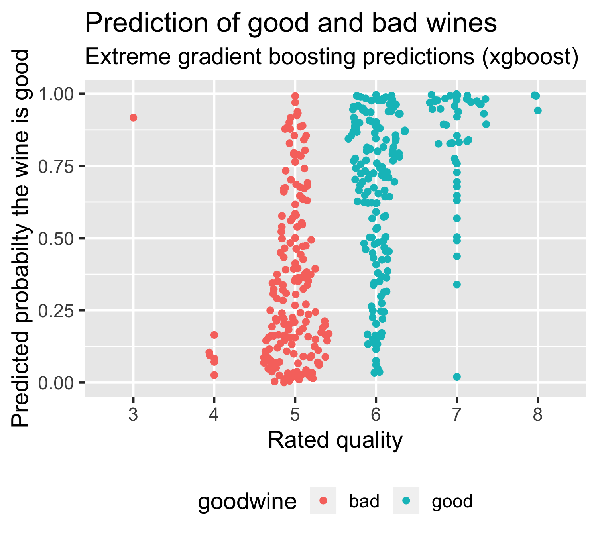

```{r setup, include=FALSE, warnings=FALSE}
knitr::opts_chunk$set(echo = FALSE)
knitr::opts_chunk$set(cache = TRUE)

library(tidyverse)
library(skimr)
library(lme4)

set.seed(1)
rm(list = ls(all = TRUE))
```

## Workshop Purpose{.smaller}
-- Show how Human Factors professionals can contribute to machine learning and <br /> how machine learning can contribute to Human Factors research and design

-- Discuss issues and demonstrate techniques  

 
```{r, out.width="47%"}

```
 


## Workshop Purpose: Promote replicable research{.smaller .build}
Sandve, G. K., Nekrutenko, A., Taylor, J., & Hovig, E. (2013). Ten simple rules for reproducible computational research. \textit{PLoS Computational Biology}, 9(10), 1-4. 

Rule 1: For Every Result, Keep Track of How It Was Produced (Run script in R)

Rule 2: Avoid Manual Data Manipulation Steps (Run script in R)

Rule 3: Archive the Exact Versions of All External Programs Used (Run checkpoint())

Rule 4: Version Control All Scripts (Use GitHub through RStudio)

Rule 5: Record All Intermediate Results (Create code chunks in R Notebook with inputs and output files)

Rule 6: For Analyses That Include Randomness, Note Underlying Random Seeds (Run set.seed(42))

Rule 7: Always Store Raw Data behind Plots (Run script in R)

Rule 8: Generate Hierarchical Analysis Output (Use R Studio Project file)

Rule 9: Connect Textual Statements to Underlying Results (Use R Notebook)

Rule 10: Provide Public Access to Scripts, Runs, and Results (Use GitHub through RStudio)

---

```{r typesofML, echo = FALSE, warning=FALSE}
knitr::include_graphics("PhDComicsVersionControl.png", dpi = 120)
```


 
## Introductions 
-- Name

-- Research or design focus

-- Objectives in taking the workshop

## Workshop Overview
-- Data visualization: Don't analyze in uncharted territory

-- Data reduction and cleaning: 80% of any data analysis

<br />
<br />
<span style="font-size:2em">Lunch</span>
<br />
<br />
<br />

-- Multi-level general linear models: <br /> Not just accommodating correlated responses with repeated measures experimental designs

-- Machine learning overview and implementation

-- Survey of machine learning behavioral issues and applications

