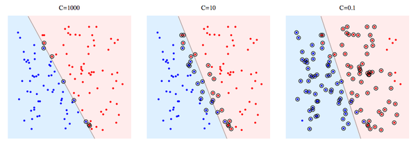
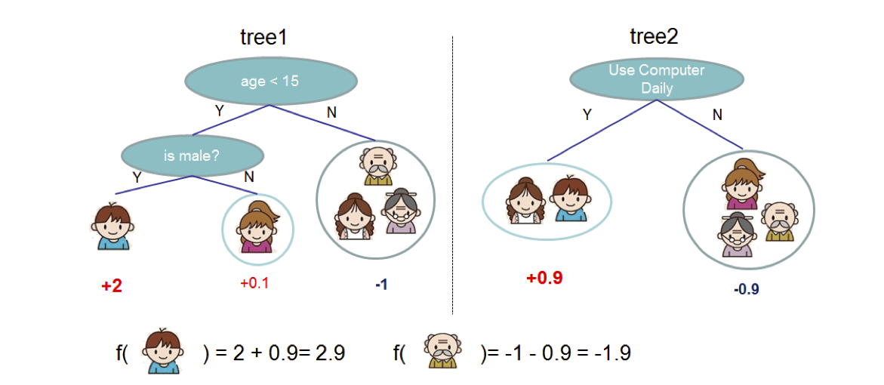
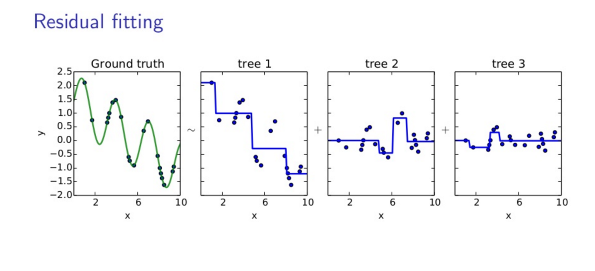
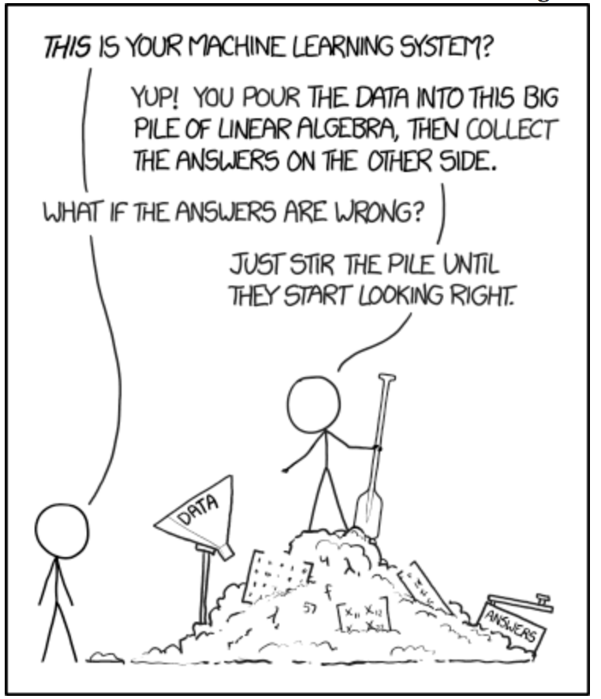
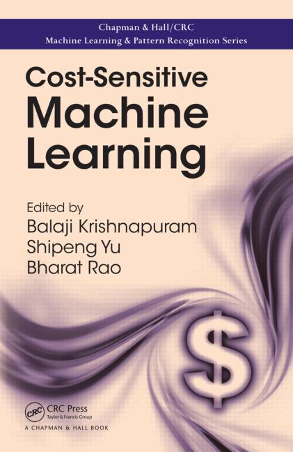

<style>
.forceBreak { -webkit-column-break-after: always; break-after: column; column-width: 500px }
</style>


```{r setup, include=FALSE}
knitr::opts_chunk$set(echo = FALSE)
knitr::opts_chunk$set(cache = FALSE)

#### Detailed description of the caret package to develop, tune and validate a range of data mining models ####
# http://www.jstatsoft.org/v28/i05/paper

library(tidyverse)
library(skimr)
library(lme4) # Foy
#yr the sleep study data
library(caret)
library(kernlab)
library(ipred)
library(ggpubr)
library(checkpoint)

library(ROCR)
library(pROC)
library(plotROC)


checkpoint("2018-09-26")
set.seed(42)
rm(list = ls(all = TRUE))
```


## General Types of Supervised Learning 

-- Regression (predict a continuous variable) with "wine quality" dataset

-- Classification (predict category membership) with "breast cancer" dataset

-- Classification (predict category membership) with "wine quality" dataset:
Good and bad wine


## Kaggle Data Repository (https://www.kaggle.com)
-- Kaggle hosts machine learning competitions, data, and advice

-- Wisconsin Cancer Diagnosis Data
https://www.kaggle.com/uciml/breast-cancer-wisconsin-data
   
-- Wine Quality Data
https://www.kaggle.com/uciml/red-wine-quality-cortez-et-al-2009


## caret Package for Machine Learning

http://topepo.github.io/caret/index.html

-- Provides an integrated set of functions to support machine learning

-- Provides uniform interface to over 200 algorithms 
(e.g., linear regression, random forest, support vector machines) 

-- Makes training and testing many types of models very easy

-- Incorporates sensible defaults that often work well


##  Simplified Machine Learning Process{.build}

-- Partition data into training and test sets

-- Pre-process data and select features

-- Tune model hyperparameters with cross validation

-- Estimate variable importance 

-- Assess predictions and model performance with test data

-- Compare model performance


## Read and Visualize Data
```{r read_data, echo = TRUE, warning=FALSE, message=FALSE}

wine.df = read_csv("winequality-red.csv")
skim(wine.df)

```


## Read and Visualize Data
```{r, warning=FALSE, echo = TRUE}

featurePlot(x = wine.df[, 2:11], y = wine.df$quality, 
            plot = "scatter",
            type = c("p", "smooth"), span = .5,
            layout = c(5, 2))

```


## Define Class Variable{.smaller} 
```{r define-class, echo = TRUE, warning=FALSE, message=FALSE, out.width="60%"}

quality.wine.df = wine.df %>% mutate(goodwine = if_else(quality>5, "good", "bad")) %>% 
  mutate(goodwine = as.factor(goodwine))

ggplot(quality.wine.df, aes(goodwine, quality, colour = goodwine, fill = goodwine))+
  geom_point(size = .5, alpha = .7, position = position_jitter(height = 0.1))+
  labs(x = "Discretized wine quality", y = "Rated wine quality")+
  theme(legend.position = "none")

wine.df = quality.wine.df %>% select(-quality)

```


## Holdout Validation
```{r fitvalidation, echo = FALSE, warning=FALSE,fig.height=7}
knitr::include_graphics("1.FittingValidation.png", dpi=120)
```


## Cross-validation: Repeated k-fold cross-validation
```{r crossvalidation, echo = FALSE, warning=FALSE,fig.height=7}
knitr::include_graphics("2. CrossvalidationRepeatedcrossvalidation.png", dpi=120)
```


## Partition Data into Training and Testing
-- Proportions of class variable---good and bad wine---should be similar

-- Proportions of class variables should be similar in test and training data

-- ``createDataPartition`` Creates partitions that maintains the class distribution


## Partition Data into Training and Testing
```{r partition, echo = TRUE}
inTrain = createDataPartition(wine.df$goodwine, p = 3/4, list = FALSE)

trainDescr = wine.df[inTrain, -12] # All but class variable
testDescr = wine.df[-inTrain, -12]

trainClass = wine.df$goodwine[inTrain] 
testClass = wine.df$goodwine[-inTrain]
```


## Partition Data into Training and Testing
```{r partition_table, echo = TRUE}
wine.df$goodwine %>%  table() %>% prop.table() %>% round(3)*100 
trainClass %>% table() %>% prop.table() %>% round(3)*100
testClass %>% table() %>% prop.table() %>% round(3)*100
```


## Pre-process Data: Filter poor predictors
-- Eliminate variables with no variabilty

-- Eliminate highly correlated variables

-- Select predictive features

-- Engineer predictive features


## Pre-process Data: Normalization
-- ``preProcess`` also supports other preprocessing methods, such as PCA and ICA

-- ``center`` subtracts mean

-- ``scale`` normalizes based on standard deviation

```{r pre-process, echo = TRUE, cache=FALSE, warning=FALSE, message=FALSE}
xTrans = preProcess(trainDescr, method = c("center", "scale")) 
trainScaled = predict(xTrans, trainDescr)
testScaled = predict(xTrans, testDescr)
```


## Pre-process Data: Normalization
```{r pre-process-plot, echo = FALSE, warning=FALSE, message=FALSE, fig.height=5.5}
raw.plot = ggplot(trainDescr, aes(alcohol))+geom_histogram()
scaled.plot = ggplot(trainScaled, aes(alcohol))+geom_histogram()

ggarrange(raw.plot, scaled.plot, 
          labels = c("Original", "Normalized"),
          nrow=2, ncol = 1, align = "v")
```

## Exercise: Partition and pre-process data{.build .smaller}
-- Load and review the Wisconsin cancer data

``cancer.df = read_csv("cancer.csv")``

``skim(cancer.df)``

-- Identify the diagnosis indicator

-- Partition data

``inTrain = createDataPartition(cancer.df$diagnosis, p = 3/4, list = FALSE)``

``trainDescr = cancer.df[inTrain, -(1:2)] # All but class variable``

``testDescr = cancer.df[-inTrain, -(1:2)]``

``trainClass = cancer.df$diagnosis[inTrain] ``

``testClass = cancer.df$diagnosis[-inTrain]``

-- Pre-process data

``xTrans = preProcess(trainDescr, method = c("center", "scale")) ``

``trainScaled = predict(xTrans, trainDescr)``

``testScaled = predict(xTrans, testDescr)``


## Cross-validation
-- Used to select best combination of predictors and model parameters

-- Estimates model performance (e.g., AUC or r-square) for each candidate model

-- Uses a random subset of the training data to train the model and a withheld subset to test

```{r kfoldcrossvalidation, echo = FALSE, warning=FALSE, message=FALSE, fig.height=4.5}

knitr::include_graphics("K-fold_cross_validation.jpg", dpi = 75)
```


## Cross-validation: Hyperparameter tuning
```{r tuning, echo = FALSE, warning=FALSE,fig.height=7}
knitr::include_graphics("3.TrainTestTune.png", dpi=60)
```


## Grouped Cross-validation|Sleep study example
``sleep.df = sleepstudy``<br>
``folds <- groupKFold(sleep.df$Subject, k = 18)``

```{r groupfold, echo=TRUE, echo=FALSE, fig.height=4.25}

sleep.df = sleepstudy
folds <- groupKFold(sleep.df$Subject, k = 18) # k = number of folds


subjects = sleep.df$Subject
in_model <- lapply(folds, function(ind, grp) grp[ind], grp = subjects)
in_model_df <- data.frame(Subject = unlist(in_model), data = "Training")
in_model_df$Fold <- rep(names(in_model), times = unlist(lapply(in_model, length)))
holdout <- lapply(folds, function(ind, grp) grp[-unique(ind)], grp = subjects)
holdout_df <- data.frame(Subject = unlist(holdout), data = "Heldout")
holdout_df$Fold <- rep(names(holdout), times = unlist(lapply(holdout, length)))
both <- rbind(in_model_df, holdout_df)
both$Fold = gsub(pattern = "Fold",replacement = "", x = both$Fold)

ggplot(both, aes(x = Fold, y = Subject, fill = data)) + 
  geom_tile() + 
  labs(title = "Grouped cross validation",
       x = "Fold", y = "Subject", fill = "Data use") +
  scale_fill_manual(values = c("grey90", "grey35"))+
  theme(legend.position = "top")+
  theme_gray(base_line_size = 14)

# train.control = trainControl(method = "repeatedcv", 
#                               number = 10, repeats = 3, # number: number of folds
#                               search = "grid", # for tuning hyperparameters
#                               index = folds,
#                               savePredictions = "final")
# 
# lm.fit = train(Reaction~Days, data = sleep.df,
#    method = 'lm',
#    trControl = train.control) 
# lm.fit
# 
# xgb.fit = train(Reaction~Days, data = sleep.df,
#    method = 'xgbTree',
#    trControl = train.control) 
# xgb.fit

```


## Define Training Parameters
-- Select cross validation method: 10-fold repeated cross validation is common

-- Define hyperparameter selection method: grid search is the simplest approach

-- Define summary measures

-- ``trainControl`` command specifies all these parameters in a single statement


## Define Training Parameters: ``trainControl``
```{r tune, echo=TRUE}
train.control = trainControl(method = "repeatedcv", 
                              number = 10, repeats = 3, # number: number of folds
                              search = "grid", # for tuning hyperparameters
                              classProbs = TRUE,
                              savePredictions = "final",
                              summaryFunction = twoClassSummary)
```


## Select Models to Train
-- Over 200 different models from 50 categories (e.g., Linear regression, boosting, bagging, cost sensitive learning)

-- List of models: http://caret.r-forge.r-project.org/modelList.html

-- The "train" statement can train any of them

-- Here we select three:

    - Logistic regression

    - Support vector machine

    - Xgboost, a boosted random forest that performs well in many situations


## Train Models and Tune Hyperparameters with the ``train`` function
-- Specify class and predictor variables

-- Specify one of the over 200 models (e.g., xgboost)

-- Specify the metric, such as ROC

-- Include the train control specified earlier


## Train Models and Tune Hyperparameters: <br>Logistic regression
-- Logistic regression has no tuning parameters

-- 10-fold repeated (3 times) cross-validation occurs once 

-- Produces a total of 30 instances of model fitting and testing

-- Cross validation provides a nearly unbiased estimate of the performance of the model on the held out data


## Train Models and Tune Hyperparameters: Logistic regression{.smaller}
```{r, train_glm, cache = TRUE, echo=TRUE, warning=FALSE}
glm.fit = train(x = trainScaled, y = trainClass,
   method = 'glm', metric = "ROC",
   trControl = train.control) 

glm.fit
```


## Train Models and Tune Hyperparameters: Support vector machine{.smaller}
- Linear support vector machines have a single tuning parameter--C

- C (Cost) 

- C = 1000 "hard margin" tends to be sensitive to individual data points and is prone to over fitting

```{r, out.width="85%"}

```

https://stackoverflow.com/questions/4629505/svm-hard-or-soft-margins


## Train Models and Tune Hyperparameters: Support vector machine{.smaller}
```{r, train_svm, cache=TRUE,  echo=TRUE, message=FALSE, warning=FALSE, fig.height=3}
grid = expand.grid(C = c(.1, .2, .4, 1, 2, 4))
svm.fit =  train(x = trainScaled, y = trainClass,
  method = "svmLinear", metric = "ROC",
  tuneGrid = grid, # Overrides tuneLength
  tuneLength = 3, # Number of levels of each hyper parameter, unless specified by grid
  trControl = train.control, scaled = TRUE)

plot(svm.fit)
```


## Train Models and Tune Hyperparameters: xgboost
Classification depends on adding outcomes across many trees

```{r, out.width="85%"}

```

<span style="font-size:.5em">Chen, T., & Guestrin, C. (2016). XGBoost: A scalable tree boosting system. Proceedings of the 22nd ACM SIGKDD International Conference on Knowledge Discovery and Data Mining, 785–794.</span>

## Train Models and Tune Hyperparameters: xgboost
Trees are built in sequence to address the errors (residuals) of the previous trees

```{r, out.width="90%"}

```

<span style="font-size:.5em">https://towardsdatascience.com/</span>


## Train Models and Tune Hyperparameters: xgboost

-- nrounds (# Boosting Iterations)--model robustness

-- max_depth (Max Tree Depth)--model complexity

-- eta (Shrinkage)--model robustness

-- gamma (Minimum Loss Reduction)--model complexity

-- colsample_bytree (Subsample Ratio of Columns)--model robustness

-- min_child_weight (Minimum Sum of Instance Weight)--model complexity

-- subsample (Subsample Percentage)--model robustness

**A grid search with 3 levels for each parameter produces 3^7 combinations!**


## Train Models and Tune Hyperparameters: xgboost

``tuneLength = 3`` produces 

    - nrounds (# Boosting Iterations) (50 100 150)

    - max_depth (Max Tree Depth) (1, 2, 3)

    - eta (Shrinkage) (.3, .4)

    - gamma (Minimum Loss Reduction) (0)

    - colsample_bytree (Subsample Ratio of Columns) (.6, .8)

    - min_child_weight (Minimum Sum of Instance Weight) (1)

    - subsample (Subsample Percentage) (.50, .75, 1.0)

-- 108 different model combinations each trained and tested 10X3 times


## Train models and tune Hyperparameters: xgboost
```{r, train_xgb, echo=TRUE, cache=TRUE, warning=FALSE, message=FALSE}
xgb.fit = train(x = trainScaled, y = trainClass,
  method = "xgbTree", metric = "ROC",
  tuneLength = 3, # Depends on number of parameters in algorithm
  trControl = train.control, scaled = TRUE)
```


## Train models and tune: xgboost
```{r, plot_train_xgb, echo=FALSE, cache=TRUE, warning=FALSE, message=FALSE, fig.height=4.5}
plot(xgb.fit)
```


## Exercise: Train and Tune Hyperparameters{.build}
-- Set training parameters

``train.control = ``<br>
``trainControl(method = "repeatedcv",`` <br>
              ``number = 10, repeats = 3, # number: number of folds``<br>
              ``search = "grid", # for tuning hyperparameters``<br>
              ``classProbs = TRUE,``<br>
              ``savePredictions = "final",``<br>
              ``summaryFunction = twoClassSummary)``
                              
-- Train an extreme boosting tree 

``xgb.fit = train(x = trainScaled, y = trainClass,``<br>
  ``  method = "xgbTree", metric = "ROC",``<br>
 ``  tuneLength = 3, # Depends on number of parameters in algorithm``<br>
 ``  trControl = train.control, scaled = TRUE)``
 
 -- Identify the best combination of Hyperparameters

  
## Assess Performance: Confusion matrix (glm)
```{r, assess-glm,  echo=TRUE}
glm.pred = predict(glm.fit, testScaled)

confusionMatrix(glm.pred, testClass)
```


## Assess Performance: Confusion matrix (svm)
```{r, assess-svm,  echo=TRUE}
svm.pred = predict(svm.fit, testScaled)

confusionMatrix(svm.pred, testClass)
```


## Assess Performance: Confusion matrix (xgb)
```{r, assess-xgb,  echo=TRUE}
xgb.pred = predict(xgb.fit, testScaled)

confusionMatrix(xgb.pred, testClass)
```


## Compare Models
```{r, compare_boxplot, cache=TRUE, echo=TRUE}
mod.resamps = resamples(list(glm = glm.fit, svm = svm.fit, xgb = xgb.fit))

bwplot(mod.resamps, metric="ROC")
# dotplot(mod.resamps, metric="ROC")
```


## Assess Performance (xgb): ROC plot{.smaller}
```{r, assess_ROC, warning=FALSE, echo=FALSE, out.width="90%"}
xgb.pred = predict(xgb.fit, testScaled, type="prob")
xgb.roc = roc(predictor = xgb.pred$good, 
              response = testClass, 
              AUC = TRUE, ci = TRUE)
xgb.roc.df = data.frame(obs = xgb.roc$original.response, pred = xgb.roc$predictor)

xgb.roc.plot = 
ggplot(xgb.roc.df, aes(d = obs, m = pred)) + 
  geom_roc(labels = FALSE, linealpha = .8) + # Labels show the predictor value
   annotate("text", x = .5, y = .475, hjust = 0,
           label = paste("AUC(xbg) =", round(xgb.roc$auc, 2))) +
  labs(title = "Prediction of good and bad wines", 
       subtitle = "Extreme gradient boosting predictions (xgboost)") +
  coord_fixed(ratio = 1) +
  style_roc() 
  
xgb.roc.plot
ggsave("xgb-roc.png", xgb.roc.plot, width = 5, height = 4.5)

```


## xgboost Predictions
```{r, xgb-pred-plot, out.width="90%"}
#xgb.pred.df = cbind(xgb.pred, testScaled)
# xgb.pred.df = cbind(xgb.pred, testClass)
# xgb.pred.df = cbind(xgb.pred.df, testDescr)
# 
# xgb.pred.plot = ggplot(xgb.pred.df, aes(alcohol, good, color = testClass))+
#   geom_point()+
#   labs(title = "Prediction of good and bad wines", 
#        subtitle = "Extreme gradient boosting predictions (xgboost)",
#        x = "Alcohol content (%)",
#        y = "Predicted probabilty the wine is good",
#        colour= "Rated wine quality")
# xgb.pred.plot
# ggsave("xgb-pred.png", xgb.pred.plot, width = 5, height = 4.5)

predicted.df = cbind(xgb.pred, quality.wine.df[-inTrain, ])

library(ggforce)
predicted_wine.plot = 
  ggplot(predicted.df, aes(as.factor(quality), good, colour = goodwine)) + 
  geom_sina() +
  labs(title = "Prediction of good and bad wines", 
       subtitle = "Extreme gradient boosting predictions (xgboost)",
       x = "Rated quality",
       y = "Predicted probabilty the wine is good") +
  theme_gray(base_size = 14) +
  theme(legend.position="bottom") 
predicted_wine.plot
ggsave(filename = "predicted_wine.png", plot = predicted_wine.plot, width = 5, height = 4.5)

```


## Assess Variable Importance: glm and xgb{.columns-2}
```{r, assess-var-glm, fig.width=5, fig.height=5}
  plot(varImp(glm.fit, scale = TRUE), main = "glm")
```

```{r, assess-var-xgb, fig.width=5, fig.height=5}
  plot(varImp(xgb.fit, scale = TRUE), main = "xgb")
```


## Exercise: Assess model performance and variable importance{.build}
-- Assess model performance

``xgb.pred = predict(xgb.fit, testScaled)``

``confusionMatrix(xgb.pred, testClass)``

-- Assess variable importance

``plot(varImp(xgb.fit, scale = TRUE))``


## Addressing the Black Box Problem with Understandable Models {.smaller}
```{r, Understand, out.width="43%"}
  
```


## An Understandable Model|Fast and frugal decision trees
```{r, train_fft, message=FALSE, echo=TRUE}
library(FFTrees)
wine.df =  read_csv("winequality-red.csv")
wine.df = wine.df %>% mutate(goodwine = if_else(quality>5, TRUE, FALSE)) %>%
  select(-quality)

inTrain = createDataPartition(wine.df$goodwine, p = 3/4, list = FALSE)
train.wine.df = wine.df[inTrain, ] 
test.wine.df = wine.df[-inTrain, ]

fft.fit = FFTrees(formula = goodwine~., data = train.wine.df, do.comp = FALSE)
```


## Fast and Frugal Decision Tree
```{r, plot_fft, out.width="90%"}
  plot(fft.fit)
```


## Understandable (fft) and Sophisticated (xgb) 
```{r, compare_fft_xgb, warning=FALSE, echo=FALSE, out.width="92.5%"} 

fft.pred = predict(fft.fit, newdata =test.wine.df, type = "prob")
fft.roc = roc(predictor = fft.pred[, 2], response = test.wine.df$goodwine,
              AUC = TRUE, ci = TRUE)

fft.roc.df = data.frame(obs = fft.roc$original.response, pred = fft.roc$predictor)

xgb.roc.plot +
  geom_roc(data = fft.roc.df, color = "blue", labels = FALSE) +
  annotate("text", x = .5, y = .4, color = "blue", hjust = 0,
           label = paste("AUC(fft) =", round(fft.roc$auc, 2)))
```


## Regression|Prediction of continuous variables{.columns-2}
-- Similar process different performance metrics

    - RMSE--Root mean square error

    - MAE--Mean absolute error

-- General issues with model metrics 

    - How to penalize the model for large deviations?

    - Does the sign of the error matter?
    
    - How to define and ensure fair algorithms?
<br />
<br />
-- Cost sensitive learning and optimal $\beta$
  - Similar to the issue with classificaiton: Are misses and false alarms equally problematic?
    

```{r, out.width="45%"}
  
```
    
    
## Cross validation: Deploy and monitor
```{r deploy, echo = FALSE, warning=FALSE,fig.height=7}
knitr::include_graphics("4.DeployMonitor.png", dpi=120)
```


##  Simplified Machine Learning Process

-- Partition data into training and test sets

-- Pre-process data and select features

-- Tune model hyperparameters with cross validation

-- Estimate variable importance 

-- Assess predictions and model performance with test data

-- Compare model performance

**At each step be sure to model with people in mind**

 