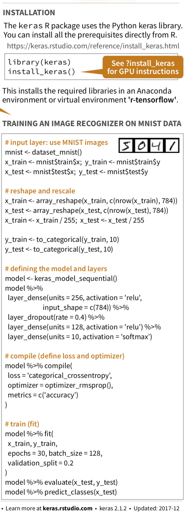

```{r setup, include=FALSE, warnings=FALSE}
knitr::opts_chunk$set(echo = FALSE)
knitr::opts_chunk$set(cache = TRUE)

library(tidyverse)
library(skimr)
library(lme4)
library(umap)


set.seed(42)
rm(list = ls(all = TRUE))
```


## Machine Learning Next Steps
-- Machine learning challenges and opportunities

-- Other machine learning techniques

-- Machine learning resources

<span style="font-size:.75em">
Friday 8:30 Grand Ballroom C, Human in Focus: Feature research and application of ubiquitous user monitoring
</span>


## Machine Learning Challenges and Opportunities|Issues that behavioral scientists can help address{.build}

-- Representative sampling

-- Differential costs of prediction errors

-- Tradeoff of model understandability and performance

-- Explaining model output (LIME)

-- Ethical considerations

-- Design thinking and systems thinking


## Machine Learning Techniques|Text analysis: Quantitative analysis of qualitative data 

```{r, out.width="60%"}
knitr::include_graphics("TopicNetwork.png")

```

<span style="font-size:.75em">
Lee, J. D., & Kolodge, K. (2019). Exploring trust in self-driving vehicles with text analysis. Human Factors. 
</span>


## Machine Learning Techniques|Visualizing multidimensional data 

```{r umap_visualiztion, echo=FALSE, message=FALSE, warning=FALSE, cache = TRUE, out.width="85%"}
set.seed(42)

wine.df = read_csv("winequality-red.csv")

wine.umap = wine.df %>% 
  select(-quality) %>% 
  umap()

umap.layout = wine.umap$layout # Extract the dimensions
colnames(umap.layout) = c("x", "y") 

wine_umap.df = cbind(wine.df, umap.layout)

ggplot(wine_umap.df, aes(x, y, colour = quality>5))+
  geom_point(size = .8)+
  labs(title = "Dimensions of wine quality reduced to two",
       x = "Dimension 1", y = "Dimension 2") +
  theme_gray(base_size = 14)  

```


## Machine learning resources: caret

-- Comprehenvise online description of caret features (http://topepo.github.io/caret/index.html)

-- Early draft of book on feature engineering by the author of caret (http://www.feat.engineering)

```{r, out.width="30%"}
knitr::include_graphics("caret_Applied_Predictive_Modeling.jpg")
```


## Machine Learning Resources: Keras  {.columns-2}

-- Simple interface to powerful deep learning algorithms

-- Support for prototyping through deployment

-- Implement and deply in an afternoon
<br>
<br>
<br>
<br>


```{r, out.width="50%"}
knitr::include_graphics("keras-logo.png")
```
 
https://keras.rstudio.com

<p class="forceBreak"></p>

```{r, out.width="38%"}

```


## Machine Learning Resources: Kaggle

-- Data--over 10,000 datasets

-- Competitions

-- Kernels--code developed for analysis of datasets hosted on kaggle

```{r, out.width="50%"}
knitr::include_graphics("Kaggle.png")
```

https://www.kaggle.com


## Machine Learning Resources: DataCamp

-- Online courses with integrated exercises

-- Including basic R and advanced courses 

-- Machine learning toolbox by the author of caret

-- Writing functions by author of the tidyverse

```{r, out.width="40%"}
knitr::include_graphics("DataCamp.jpg")
```

https://www.datacamp.com/courses/machine-learning-toolbox


## Workshop Summary{.build}
Human Factors contributions to ML and ML contributions to Human Factors

-- Data visualization: Don't venture into uncharted territory

-- Data reduction and cleaning: 80% of any data analysis

-- Multi-level general linear models: Model individual variability

-- Machine learning overview and implementation: Adopt different statistical mindset 

-- Survey of machine learning behavioral issues and applications: Design for people

Repeatable data analysis with R and RStudio

<span style="font-size:.75em">
Friday 8:30 Grand Ballroom C, Human in Focus: Feature research and application of ubiquitous user monitoring
</span>

